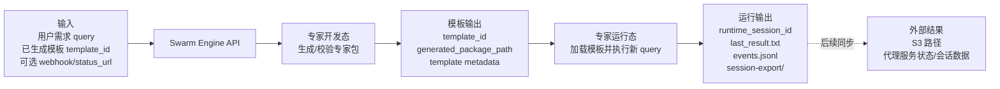
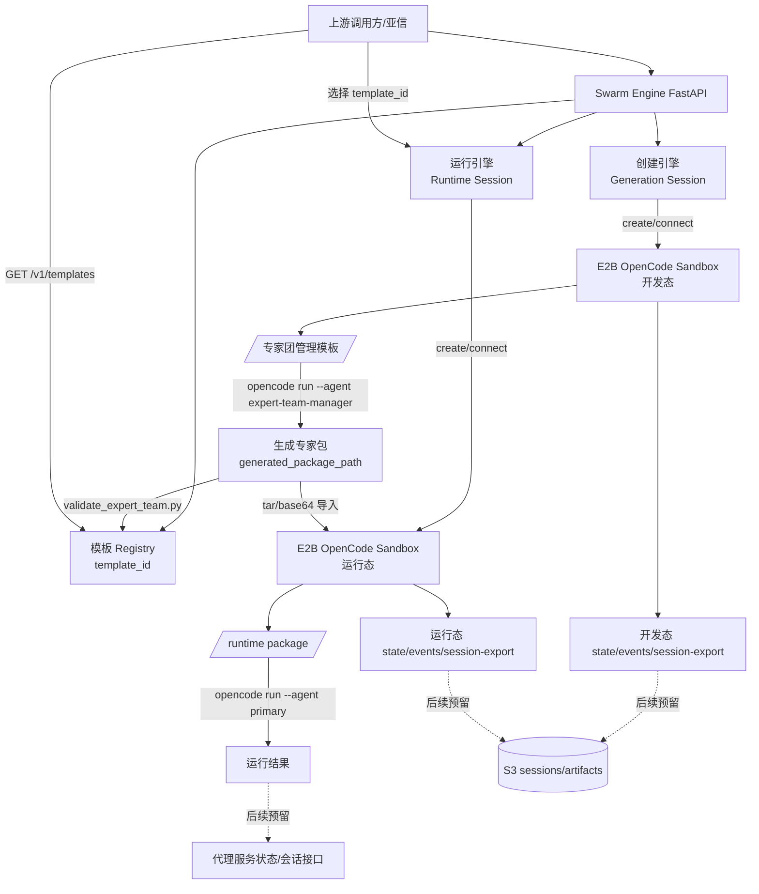

# Swarm Engine 对接技术方案

本文说明当前项目与上游调用方、E2B OpenCode Sandbox 内部流程的对接方式，并列出后续可能替换为 CM Sandbox、S3 同步、代理协议 hook 时需要改造的位置。

当前原则：

- **Sandbox 暂时不改**：仍使用 E2B sandbox。
- **OpenCode 执行方式暂时不改**：仍沿用当前 E2B 内置 `opencode` 和 `opencode run` 逻辑。
- **`0.0.0.0:4096` 的含义**：用于让外部能够访问 E2B sandbox 内的 OpenCode 服务/端口，不代表当前要把执行链路改成 OpenCode Server API。
- **CM Sandbox/S3/代理协议先预留**：文档中标出后续替换点和占位路径，代码当前仍按 E2B 执行。

## 1. 当前目标流程

上游调用方要完成两类流程：

1. **专家开发态**：创建 sandbox，使用 E2B 内置 OpenCode 生成专家智能体模板/专家包。
2. **专家运行态**：选择已生成模板，创建新的 runtime sandbox，加载该专家包并执行新的 query。

最终输出：

- 专家包路径。
- 模板 `template_id`。
- runtime 会话路径。
- 会话状态和事件文件。
- 后续可同步到 S3 的专家依赖、会话数据、制品产物路径。

## 2. 输入输出总览

先看整体输入和输出，便于对方案时快速确认边界。



输入分三类：

- **开发态输入**：用户生成需求 `query`、可选 `output_root`、可选 `output_slug`。
- **运行态输入**：前端选择的 `template_id`、新 query、可选 agent。
- **集成输入**：可选 webhook/status_url；后续预留模型 JSON、S3 目录、代理协议配置。

输出分三类：

- **模板输出**：`template_id`、`generated_package_path`、模板元数据文件。
- **运行输出**：`runtime_session_id`、runtime package 路径、执行结果、事件和会话导出。
- **外部同步输出**：后续可同步到 S3 的专家依赖、会话数据、制品产物，以及代理服务状态/会话数据。

## 3. 详细架构图

下面保留完整架构图，展示每一块内部如何衔接。



## 4. 上游调用方接口

### 4.1 创建开发态 Sandbox

当前接口：

```http
POST /v1/sessions
```

请求：

```json
{
  "user_id": "user-1",
  "webhook_url": "https://example.com/session-events",
  "session_status_url": "https://example.com/session-status",
  "keep_sandbox": true
}
```

作用：

- 创建 E2B `opencode` sandbox。
- 将专家团管理模板复制到 `/home/user/template`。
- 注入 `session-export.ts`、`session-import.ts`、`proxy-hooks.ts`。
- 写入 `state/status.json`。

返回重点：

- `session_id`
- `sandbox_id`
- `status`
- `session_export_path`
- `state_path`

后续预留：

- 如果未来切 CM Sandbox，这里替换 sandbox factory 即可。
- 如果需要暴露 E2B 内 OpenCode 服务，可在 sandbox 初始化后启动监听 `0.0.0.0:4096` 的 opencode 服务，并把访问地址写入 `data.opencode_endpoint`。

### 4.2 生成专家模板/专家包

当前接口：

```http
POST /v1/sessions/{session_id}/generate
```

请求：

```json
{
  "user_id": "user-1",
  "query": "创建一个软件交付专家团队",
  "output_root": "exports/custom-output",
  "output_slug": "software-delivery-team",
  "timeout_ms": 600000
}
```

当前执行：

```bash
opencode run --agent expert-team-manager <prompt>
```

输出：

- `generated_package_path`
- `data.template_id`
- `data.validation_stdout`

生成成功后也会写模板元数据：

```text
/home/user/template/.engine-sessions/<session_id>/state/template-<template_id>.json
```

### 4.3 查询模板列表

当前接口：

```http
GET /v1/templates?user_id=user-1
```

作用：

- 给上游/前端展示当前已生成模板。
- 供用户选择某个 `template_id` 创建运行态。

返回字段：

- `template_id`
- `source_session_id`
- `source_sandbox_id`
- `package_path`
- `output_root`
- `output_slug`
- `status`
- `created_at`

### 4.4 创建运行态 Sandbox

当前接口：

```http
POST /v1/runtime-sessions
```

推荐请求：

```json
{
  "user_id": "user-1",
  "template_id": "<template-id>",
  "webhook_url": "https://example.com/runtime-events",
  "session_status_url": "https://example.com/runtime-status",
  "keep_sandbox": true
}
```

当前执行：

1. 创建新的 E2B runtime sandbox。
2. 从源 sandbox 的 `package_path` 打 tar/base64。
3. 解压到 runtime sandbox：

   ```text
   /home/user/template/.runtime-sessions/<runtime_session_id>/package
   ```

4. 注入同一组 OpenCode 插件。
5. 合并 runtime package 的 `opencode.json` 插件配置。
6. 自动识别 `mode: primary` 的 agent。

返回重点：

- `runtime_session_id`
- `sandbox_id`
- `source_package_path`
- `runtime_package_path`
- `data.primary_agent`

### 4.5 执行运行态 Query

当前接口：

```http
POST /v1/runtime-sessions/{runtime_session_id}/query
```

请求：

```json
{
  "user_id": "user-1",
  "query": "用刚生成的专家团分析这个需求",
  "agent": "<optional-agent-id>",
  "timeout_ms": 600000
}
```

当前执行：

```bash
opencode run --agent <primary-agent> <query>
```

工作目录：

```text
/home/user/template/.runtime-sessions/<runtime_session_id>/package
```

输出：

- `status`
- `data.last_stdout`
- `data.last_stderr`
- `data.last_result_path`

### 4.6 查询和关闭

生成态：

```http
GET /v1/sessions/{session_id}/status?user_id=user-1
POST /v1/sessions/{session_id}/close
```

运行态：

```http
GET /v1/runtime-sessions/{runtime_session_id}/status?user_id=user-1
POST /v1/runtime-sessions/{runtime_session_id}/close
```

## 5. E2B OpenCode Sandbox 内部内容

### 5.1 开发态目录

```text
/home/user/template/
├── opencode.json
├── .opencode/
│   ├── agents/
│   ├── skills/
│   └── plugins/
├── .engine-sessions/<session_id>/
│   ├── generated/
│   ├── session-export/
│   └── state/
└── exports/
```

### 5.2 运行态目录

```text
/home/user/template/.runtime-sessions/<runtime_session_id>/
├── package/
│   ├── swarm.yaml
│   ├── opencode.json
│   ├── README.md
│   └── .opencode/
├── session-export/
└── state/
    ├── status.json
    ├── events.jsonl
    ├── webhook-dead-letter.jsonl
    ├── last-query.txt
    ├── last-result.txt
    └── source-package.tar.gz.b64
```

### 5.3 插件

当前注入：

```text
.opencode/plugins/session-export.ts
.opencode/plugins/session-import.ts
.opencode/plugins/proxy-hooks.ts
```

作用：

- `session-export.ts`：导出 OpenCode session 快照到 `session-export/`。
- `session-import.ts`：导入 OpenCode session JSON。
- `proxy-hooks.ts`：监听 OpenCode event，写入 `events.jsonl`，并按 webhook 配置发送事件。

注意：当前 hook 会记录中间消息、message parts、工具调用输入输出、diff、todo、错误信息。若上游只需要状态，需要在 hook 层增加过滤或标准状态映射。

## 6. 后续预留位置

### 6.1 Sandbox 管理

当前：

- `engine/sandbox.py`
- `E2BSandboxFactory`
- `E2BSandboxHandle`

未来如果改 CM Sandbox，优先替换这一层，不改业务服务层。

### 6.2 OpenCode 可访问端口

当前：

- `OPENCODE_PORT` 默认 `4096` 已在配置中存在。
- 还没有自动启动监听 `0.0.0.0:4096` 的 opencode 服务。

后续可增加：

- sandbox 初始化时启动 opencode 服务。
- 将 `opencode_endpoint` 写入 session/runtime response 的 `data`。
- 该服务只用于外部访问 E2B 内 opencode，不改变当前 `opencode run` 主执行逻辑。

### 6.3 S3 占位目录

当前不做真实上传，只保留路径约定：

```text
s3://fake-joinai-swarm/{tenant_id}/{sandbox_id}/experts/{expert_id}/
s3://fake-joinai-swarm/{tenant_id}/{sandbox_id}/models/model.json
s3://fake-joinai-swarm/{tenant_id}/{sandbox_id}/sessions/{session_id}/
s3://fake-joinai-swarm/{tenant_id}/{sandbox_id}/artifacts/{session_id}/
```

后续可在生成完成、runtime query 完成、session-export 完成后触发上传。

### 6.4 模型 JSON

当前：

- 使用 `DEEPSEEK_API_KEY` 和 `OPENCODE_MODEL` 环境变量。

后续预留：

- 支持上游上传模型 JSON。
- 将模型 JSON 放入 sandbox 指定目录。
- 在 opencode 启动或执行时读取模型 JSON。
- 与 litellm schema 对齐。

### 6.5 代理协议 Hook

当前：

- `proxy-hooks.ts` 透传 OpenCode event。

后续应增加标准状态映射：

| OpenCode 事件 | 代理状态 |
| --- | --- |
| `session.created` | `created` |
| `session.status` busy | `running` |
| `session.idle` | `completed` |
| `session.error` | `failed` |
| interrupt 成功 | `interrupted` |
| timeout | `timeout` |
| close 成功 | `closed` |

占位状态接口：

```http
POST /proxy/session-status
```

占位会话数据接口：

```http
POST /proxy/session-data
```

## 7. 当前差距

| 目标能力 | 当前状态 | 后续改造点 |
| --- | --- | --- |
| E2B 内 OpenCode 端口可访问 | 仅有 `OPENCODE_PORT` 配置 | 初始化时启动/暴露 `0.0.0.0:4096` |
| CM Sandbox | 暂不改，仍 E2B | 未来替换 `engine/sandbox.py` |
| S3 同步 | 当前只返回 sandbox 路径 | 增加上传 experts/sessions/artifacts/models |
| 模型 JSON | 当前使用 env/model string | 增加模型 JSON 目录和加载流程 |
| 代理协议 hook | 当前事件透传 | 增加标准状态和会话数据 payload |
| 模板持久化 | 进程 registry + sandbox metadata | 后续持久化到 S3/DB |

## 8. 测试

本地测试：

```bash
python -m pytest -q
```

当前结果：

```text
16 passed
```

真实 E2B/OpenCode smoke 已验证：

- 生成专家包：`validated`
- runtime 导入模板：`ready`
- runtime query：`validated`
- template picker 通过 `template_id` 创建 runtime 并执行 query
