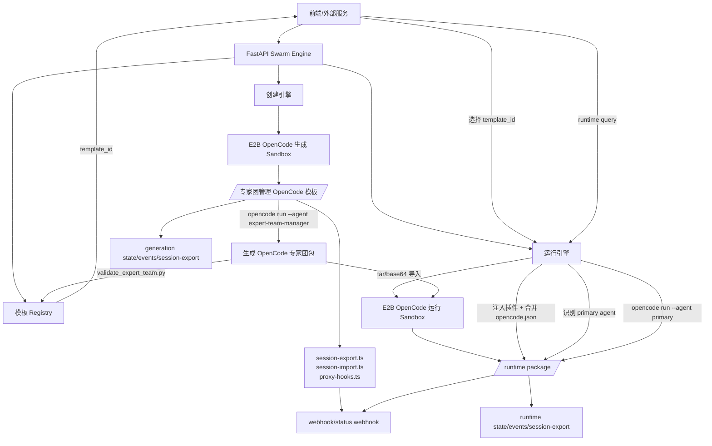

# Swarm Engine

多用户 E2B OpenCode Agent 模板生成与运行引擎。

本项目提供两条可串联的链路：

- **创建引擎**：接收用户生成需求，在 E2B `opencode` sandbox 中基于本地专家团管理模板生成新的 OpenCode 专家团包。
- **运行引擎**：前端选择已生成模板后，创建新的 E2B runtime sandbox，导入该 OpenCode 包并执行新的 query。

生成结果、状态文件、会话导出和 hook 事件都保存在 sandbox 内；S3 或其他外部同步由上层服务负责。

## 架构图



## 目录结构

```text
.
├── engine/                         # FastAPI 引擎实现
│   ├── app.py                      # HTTP API
│   ├── service.py                  # 创建/运行 session 编排
│   ├── sandbox.py                  # E2B 适配层
│   ├── assets.py                   # 模板和插件复制逻辑
│   ├── hooks.py                    # 生成 proxy-hooks.ts
│   ├── paths.py                    # sandbox 路径约定
│   ├── models.py                   # API 数据模型
│   └── state.py                    # session/template 状态记录
├── juzhigonfang-team-manager-v0.1/ # 原始 OpenCode 管理模板
├── plugins/                        # OpenCode session import/export 插件源
├── scripts/                        # 真实 E2B smoke 脚本
├── tests/                          # 本地 fake sandbox 和 API 测试
├── PROJECT.md                      # 更完整的设计记录和真实 smoke 记录
└── pyproject.toml
```

## 运行要求

需要 Python 3.11+。

运行真实 E2B/OpenCode 流程时需要环境变量：

```text
E2B_API_KEY
DEEPSEEK_API_KEY
OPENCODE_MODEL            # 可选，默认 deepseek/deepseek-v4-pro
E2B_OPENCODE_TEMPLATE     # 可选，默认 opencode
E2B_TIMEOUT_SECONDS       # 可选，默认 1800
ENGINE_DEFAULT_TIMEOUT_MS # 可选，默认 600000
```

密钥约束：

- 不把 key 写入源码。
- 不把 key 写入生成文件。
- 不把 `E2B_API_KEY` 注入 sandbox。
- `DEEPSEEK_API_KEY` 仅作为 sandbox 运行时环境变量供 OpenCode provider 使用。

## 启动服务

```bash
uvicorn engine.app:app --host 0.0.0.0 --port 8000
```

健康检查：

```http
GET /health
```

## 创建引擎接口

### 创建生成会话

```http
POST /v1/sessions
```

请求：

```json
{
  "user_id": "user-1",
  "webhook_url": "https://example.com/session-events",
  "session_status_url": "https://example.com/session-status",
  "keep_sandbox": true
}
```

返回包含：

- `session_id`
- `sandbox_id`
- `status`
- `session_export_path`
- `state_path`

### 生成 OpenCode 专家团包

```http
POST /v1/sessions/{session_id}/generate
```

请求：

```json
{
  "user_id": "user-1",
  "query": "创建一个软件交付专家团队",
  "output_root": "exports/custom-output",
  "output_slug": "software-delivery-team",
  "timeout_ms": 600000
}
```

生成成功后返回：

- `generated_package_path`
- `data.template_id`
- `data.validation_stdout`

模板元数据也会写入源 sandbox：

```text
/home/user/template/.engine-sessions/<session_id>/state/template-<template_id>.json
```

### 查询生成会话状态

```http
GET /v1/sessions/{session_id}/status?user_id=user-1
```

### 关闭生成会话

```http
POST /v1/sessions/{session_id}/close
```

## 模板选择接口

前端推荐使用 `template_id` 选择已生成模板，不要自己拼 sandbox 路径。

### 查询模板列表

```http
GET /v1/templates?user_id=user-1
```

返回项包含：

- `template_id`
- `source_session_id`
- `source_sandbox_id`
- `package_path`
- `output_root`
- `output_slug`
- `status`
- `created_at`

### 查询模板详情

```http
GET /v1/templates/{template_id}?user_id=user-1
```

## 运行引擎接口

### 创建运行会话

```http
POST /v1/runtime-sessions
```

推荐请求：

```json
{
  "user_id": "user-1",
  "template_id": "<template-id>",
  "webhook_url": "https://example.com/runtime-events",
  "session_status_url": "https://example.com/runtime-status",
  "keep_sandbox": true
}
```

兼容请求：

```json
{
  "user_id": "user-1",
  "source_session_id": "<creation-session-id>",
  "generated_package_path": "/home/user/template/exports/custom-output/software-delivery-team"
}
```

运行引擎会：

1. 创建新的 runtime sandbox。
2. 从源 sandbox 将 `package_path` 打成 tar/base64。
3. 解压到 `/home/user/template/.runtime-sessions/<runtime_session_id>/package`。
4. 注入 `session-export.ts`、`session-import.ts`、`proxy-hooks.ts`。
5. 合并 runtime package 的 `opencode.json`。
6. 自动识别 `mode: primary` 的 agent。

返回包含：

- `runtime_session_id`
- `sandbox_id`
- `source_session_id`
- `source_package_path`
- `runtime_package_path`
- `data.primary_agent`

### 执行运行会话 Query

```http
POST /v1/runtime-sessions/{runtime_session_id}/query
```

请求：

```json
{
  "user_id": "user-1",
  "query": "用刚生成的专家团分析这个需求",
  "agent": "<optional-agent-id>",
  "timeout_ms": 600000
}
```

默认执行：

```bash
opencode run --agent <primary-agent> <query>
```

工作目录：

```text
/home/user/template/.runtime-sessions/<runtime_session_id>/package
```

### 查询运行会话状态

```http
GET /v1/runtime-sessions/{runtime_session_id}/status?user_id=user-1
```

### 关闭运行会话

```http
POST /v1/runtime-sessions/{runtime_session_id}/close
```

## 前端推荐流程

```text
1. POST /v1/sessions
2. POST /v1/sessions/{session_id}/generate
3. 读取响应 data.template_id
4. GET /v1/templates?user_id=...
5. 用户选择模板
6. POST /v1/runtime-sessions，传 template_id
7. POST /v1/runtime-sessions/{runtime_session_id}/query
8. GET status 或读取返回的 state_path/session_export_path
```

## Sandbox 路径

生成会话：

```text
/home/user/template/.engine-sessions/<session_id>/
├── swarm.yaml
├── generated/
├── session-export/
└── state/
    ├── status.json
    ├── events.jsonl
    ├── webhook-dead-letter.jsonl
    ├── last-query.txt
    ├── last-prompt.txt
    ├── last-result.txt
    └── template-<template_id>.json
```

运行会话：

```text
/home/user/template/.runtime-sessions/<runtime_session_id>/
├── package/
│   ├── swarm.yaml
│   ├── opencode.json
│   ├── README.md
│   └── .opencode/
├── session-export/
└── state/
    ├── status.json
    ├── events.jsonl
    ├── webhook-dead-letter.jsonl
    ├── last-query.txt
    ├── last-result.txt
    └── source-package.tar.gz.b64
```

## Hook 和会话导出

引擎会在生成模板和 runtime package 中注入：

```text
.opencode/plugins/session-export.ts
.opencode/plugins/session-import.ts
.opencode/plugins/proxy-hooks.ts
```

`proxy-hooks.ts` 会监听 OpenCode event，写入 `state/events.jsonl`，并在配置了 webhook 时 POST 到外部服务。`session-export.ts` 会导出 OpenCode 会话快照到 `session-export/`。

注意：这些插件可能记录中间对话、message parts、工具调用输入输出、diff、todo 和错误信息。若只需要状态事件，应在 hook 层做过滤。

## 测试

本地测试：

```bash
python -m pytest -q
```

当前结果：

```text
16 passed
```

真实 E2B/OpenCode smoke 已验证：

- 创建引擎生成包：`validated`
- 运行引擎导入包：`ready`
- runtime query：`validated`
- template picker 链路：已通过 `template_id` 创建 runtime 并执行 query

详细真实 smoke 记录见 [PROJECT.md](PROJECT.md)。
