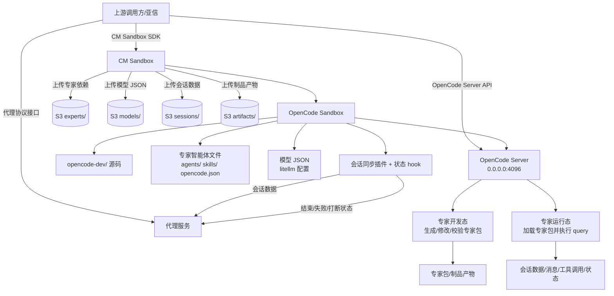

# JAS OpenCode Sandbox 对接技术方案

本文面向上游调用方（亚信）和 OpenCode Sandbox 内部研发侧，说明专家开发态/运行态的目标调用流程、当前项目能力、差距和后续改造方案。

当前仓库已实现一套 FastAPI + E2B Sandbox + OpenCode CLI 的专家生成/运行引擎；目标方案需要对接 CM Sandbox、OpenCode Server API、S3 目录同步、litellm 模型 JSON 和代理协议 hook。

> 说明：当前仓库未包含 `opencode-dev/`、`JAS OpenCode子智能体相关接口.docx`、`CM+Sandbox+SDK手册.pdf`。本文涉及 CM Sandbox SDK、OpenCode Server API、代理协议字段的部分先使用占位接口和假 S3 路径，待外部文档确认后替换为正式定义。

## 1. 总体目标

目标是让上游调用方可以完成以下闭环：

1. 通过 CM Sandbox 创建、启动、停止一个内置 OpenCode 的 sandbox。
2. 在 sandbox 内启动 OpenCode Server，监听 `0.0.0.0:4096`。
3. 上传或挂载专家文件、依赖文件、模型 JSON。
4. 调用 OpenCode Server API 完成专家开发态和运行态会话。
5. 将专家依赖、会话数据、制品产物同步到指定 S3 目录。
6. 通过 hook 将会话数据和会话状态写入代理服务接口。

## 2. 总体架构



## 3. 上游调用方流程

### 3.1 创建并启动 CM Sandbox

目标：创建一个内置 OpenCode 的 sandbox，并确保 OpenCode Server 可以通过 `0.0.0.0:4096` 访问。

占位调用：

```text
CM Sandbox SDK:
  createSandbox(template = "opencode")
  startSandbox(sandbox_id)
  exposePort(sandbox_id, 4096, host = "0.0.0.0")
```

预期输出：

```json
{
  "sandbox_id": "cm-sandbox-xxx",
  "opencode_base_url": "http://<sandbox-host>:4096",
  "status": "running"
}
```

待确认：

- CM Sandbox SDK 的正式创建/启动/停止接口名。
- 端口暴露方式和鉴权方式。
- sandbox 模板名和启动命令配置方式。

### 3.2 上传专家依赖文件到 S3 和 Sandbox

目标：将专家智能体依赖文件放到约定目录，供 OpenCode Server 加载。

占位 S3 目录：

```text
s3://fake-joinai-swarm/{tenant_id}/{sandbox_id}/experts/{expert_id}/
```

建议 sandbox 目录：

```text
/home/user/opencode-workspace/experts/{expert_id}/
├── opencode.json
├── .opencode/
│   ├── agents/
│   └── skills/
└── README.md
```

占位调用：

```text
CM Sandbox SDK:
  uploadDirectory(local_or_s3_source, sandbox_path)
  uploadDirectory(sandbox_path, s3_target)
```

### 3.3 上传模型 JSON

目标：将模型 JSON 上传到 sandbox 指定目录，作为 OpenCode 内置 litellm 模型配置。

占位 S3 目录：

```text
s3://fake-joinai-swarm/{tenant_id}/{sandbox_id}/models/model.json
```

建议 sandbox 目录：

```text
/home/user/opencode-workspace/models/model.json
```

占位模型 JSON：

```json
{
  "model_id": "deepseek-v4-pro",
  "provider": "litellm",
  "base_url": "https://example.invalid/v1",
  "api_key_env": "DEEPSEEK_API_KEY",
  "extra": {}
}
```

待确认：

- litellm 模型 JSON 的正式 schema。
- OpenCode Server 加载模型 JSON 的启动参数或配置路径。

### 3.4 启动 OpenCode Server

目标：sandbox 内启动 OpenCode Server 并监听 `0.0.0.0:4096`。

占位命令：

```bash
cd /home/user/opencode-workspace
opencode serve --host 0.0.0.0 --port 4096 \
  --model-config /home/user/opencode-workspace/models/model.json
```

待确认：

- `opencode-dev/` 中实际启动命令。
- OpenCode Server 是否需要 project/workspace 初始化接口。
- OpenCode Server API 鉴权方式。

### 3.5 调用 OpenCode Server API

目标：通过 OpenCode Server API 完成专家开发态和运行态。

占位接口：

| 目的 | 方法 | 路径 | 说明 |
| --- | --- | --- | --- |
| 健康检查 | `GET` | `/health` | 确认 OpenCode Server 已启动 |
| 创建会话 | `POST` | `/sessions` | 创建开发态或运行态会话 |
| 发送 query | `POST` | `/sessions/{session_id}/messages` | 向专家发送任务 |
| 查询会话 | `GET` | `/sessions/{session_id}` | 获取状态和元信息 |
| 获取消息 | `GET` | `/sessions/{session_id}/messages` | 获取会话消息 |
| 打断会话 | `POST` | `/sessions/{session_id}/interrupt` | 中断运行中任务 |
| 关闭会话 | `POST` | `/sessions/{session_id}/close` | 关闭或归档会话 |

待确认：以上路径需要按 `JAS OpenCode子智能体相关接口.docx` 替换为真实接口。

### 3.6 同步结果和产物

目标：上游能够拿到会话数据、专家包、制品产物和状态结果。

占位 S3 目录：

```text
s3://fake-joinai-swarm/{tenant_id}/{sandbox_id}/sessions/{session_id}/
s3://fake-joinai-swarm/{tenant_id}/{sandbox_id}/artifacts/{session_id}/
```

建议返回结构：

```json
{
  "sandbox_id": "cm-sandbox-xxx",
  "session_id": "jas-session-xxx",
  "status": "completed",
  "expert_s3_uri": "s3://fake-joinai-swarm/t1/s1/experts/e1/",
  "session_s3_uri": "s3://fake-joinai-swarm/t1/s1/sessions/jas-session-xxx/",
  "artifact_s3_uri": "s3://fake-joinai-swarm/t1/s1/artifacts/jas-session-xxx/"
}
```

## 4. OpenCode Sandbox 内部流程

### 4.1 启动初始化

sandbox 启动后执行：

1. 检查专家文件目录是否存在。
2. 检查模型 JSON 是否存在。
3. 将模型 JSON 转换或挂载为 OpenCode/litellm 可读取配置。
4. 安装或加载会话同步插件和状态 hook。
5. 启动 OpenCode Server `0.0.0.0:4096`。

建议目录：

```text
/home/user/opencode-workspace/
├── experts/
│   └── {expert_id}/
├── models/
│   └── model.json
├── sessions/
├── artifacts/
└── hooks/
```

### 4.2 专家开发态

开发态用于创建、修改、校验专家智能体包。

输入：

- 用户 query。
- 专家模板或历史专家包。
- 模型 JSON。

输出：

- `opencode.json`
- `.opencode/agents/`
- `.opencode/skills/`
- `README.md`
- `dist/<expert_id>.tar.gz`
- 校验结果。

产物上传：

```text
s3://fake-joinai-swarm/{tenant_id}/{sandbox_id}/experts/{expert_id}/
s3://fake-joinai-swarm/{tenant_id}/{sandbox_id}/artifacts/{session_id}/
```

### 4.3 专家运行态

运行态用于加载已生成专家包并执行新的 query。

输入：

- `expert_id` 或专家包 S3 URI。
- 用户 query。
- 模型 JSON。

内部动作：

1. 加载专家文件。
2. 识别 primary agent。
3. 创建 OpenCode session。
4. 执行 query。
5. 持续同步 session snapshot。
6. 结束后上传结果和制品。

输出：

- 会话状态。
- 会话消息。
- 工具调用记录。
- 生成文件/制品。
- S3 URI。

### 4.4 会话同步插件

会话同步插件负责：

- 监听 session/message/tool/todo/diff 等事件。
- 导出完整会话快照。
- 将会话数据写入 sandbox 本地目录。
- 调用 CM Sandbox SDK 或代理服务将会话数据同步到 S3。
- 调用代理协议会话数据写入接口。

建议本地目录：

```text
/home/user/opencode-workspace/sessions/{session_id}/
├── session.json
├── messages.json
├── events.jsonl
├── status.json
└── result.json
```

占位 S3 目录：

```text
s3://fake-joinai-swarm/{tenant_id}/{sandbox_id}/sessions/{session_id}/
```

### 4.5 状态 Hook

状态 hook 负责监听并上报：

- 会话开始。
- 会话运行中。
- 会话结束。
- 运行失败。
- 用户打断。
- 超时。
- sandbox 异常。

建议标准状态：

```text
created
starting
running
completed
failed
interrupted
timeout
closed
```

代理服务状态写入接口占位：

```http
POST /proxy/session-status
```

占位 payload：

```json
{
  "version": 1,
  "tenant_id": "tenant-1",
  "sandbox_id": "cm-sandbox-xxx",
  "session_id": "jas-session-xxx",
  "expert_id": "expert-xxx",
  "status": "completed",
  "event_type": "session.completed",
  "timestamp": "2026-06-01T00:00:00Z",
  "session_s3_uri": "s3://fake-joinai-swarm/t1/s1/sessions/jas-session-xxx/",
  "artifact_s3_uri": "s3://fake-joinai-swarm/t1/s1/artifacts/jas-session-xxx/",
  "error": null,
  "data": {}
}
```

代理服务会话数据写入接口占位：

```http
POST /proxy/session-data
```

占位 payload：

```json
{
  "version": 1,
  "tenant_id": "tenant-1",
  "sandbox_id": "cm-sandbox-xxx",
  "session_id": "jas-session-xxx",
  "expert_id": "expert-xxx",
  "messages": [],
  "events": [],
  "todos": [],
  "diff": [],
  "session_s3_uri": "s3://fake-joinai-swarm/t1/s1/sessions/jas-session-xxx/"
}
```

## 5. 当前项目能力

当前仓库已经实现：

- FastAPI 服务。
- 创建 session、生成专家团包、查询状态、关闭 session。
- 模板 registry：生成后返回 `template_id`，供前端选择。
- runtime session：按 `template_id` 或 `generated_package_path` 创建新 sandbox。
- runtime query：加载生成包并执行新 query。
- OpenCode 插件：
  - `session-export.ts`
  - `session-import.ts`
  - `proxy-hooks.ts`
- 本地状态文件：
  - `status.json`
  - `events.jsonl`
  - `webhook-dead-letter.jsonl`
  - `last-query.txt`
  - `last-result.txt`
- 真实 E2B/OpenCode smoke 已跑通过。

当前已有 API：

| 目的 | 方法 | 路径 |
| --- | --- | --- |
| 健康检查 | `GET` | `/health` |
| 创建生成会话 | `POST` | `/v1/sessions` |
| 生成专家团包 | `POST` | `/v1/sessions/{session_id}/generate` |
| 查询生成状态 | `GET` | `/v1/sessions/{session_id}/status` |
| 关闭生成会话 | `POST` | `/v1/sessions/{session_id}/close` |
| 查询模板列表 | `GET` | `/v1/templates` |
| 查询模板详情 | `GET` | `/v1/templates/{template_id}` |
| 创建运行会话 | `POST` | `/v1/runtime-sessions` |
| 执行运行 query | `POST` | `/v1/runtime-sessions/{runtime_session_id}/query` |
| 查询运行状态 | `GET` | `/v1/runtime-sessions/{runtime_session_id}/status` |
| 关闭运行会话 | `POST` | `/v1/runtime-sessions/{runtime_session_id}/close` |

## 6. 当前差距

| 目标能力 | 当前状态 | 差距 |
| --- | --- | --- |
| CM Sandbox 创建/启动/停止 | 使用 E2B SDK | 需要替换或新增 CM Sandbox 适配层 |
| OpenCode Server `0.0.0.0:4096` | 使用 `opencode run` CLI | 需要启动 Server 并改为调用 Server API |
| JAS OpenCode Server API | 未对接 docx | 需要按正式文档映射接口 |
| CM Sandbox 上传 S3 | 未实现 | 需要封装上传专家依赖、会话、制品、模型 JSON |
| litellm 模型 JSON | 未实现 | 需要定义模型目录、schema、加载命令 |
| 代理协议会话数据接口 | 只有 webhook 占位 | 需要对齐正式代理协议 payload |
| 结束/失败/打断状态 hook | 事件透传较粗 | 需要抽象标准状态并单独上报 |
| 会话数据同步到 S3 | 当前本地导出 | 需要增加 S3 上传或 CM SDK 调用 |
| 制品上传到 S3 | 当前保留 sandbox 路径 | 需要统一 artifacts S3 目录和上传时机 |
| 模板持久化 | 进程内 registry + sandbox metadata | 需要 S3/数据库级模板 registry |

## 7. 改造方案

### 7.1 Sandbox 适配层

新增 CM Sandbox 适配层，保留现有 E2B 适配作为本地/测试实现。

目标抽象：

```text
SandboxFactory
  create(env, template)
  start(sandbox_id)
  stop(sandbox_id)
  connect(sandbox_id)
  upload(local_or_s3, sandbox_path)
  download_or_upload_to_s3(sandbox_path, s3_uri)
  expose_port(port)
```

### 7.2 OpenCode Server 启动和 API 调用

将当前 `opencode run` 调用拆成：

1. 初始化 workspace。
2. 启动 OpenCode Server。
3. 调用 Server API 创建 session。
4. 调用 Server API 发送 query。
5. 查询/订阅 session 状态。
6. 支持 interrupt/close。

待 `JAS OpenCode子智能体相关接口.docx` 确认后，将占位接口替换成真实接口。

### 7.3 模型 JSON/litellm

新增模型配置流程：

1. 上游上传模型 JSON 到 S3。
2. CM Sandbox 将模型 JSON 放到 sandbox 模型目录。
3. OpenCode Server 启动时读取该模型配置。
4. 会话创建时可指定模型 ID。

### 7.4 会话同步和状态 Hook

将当前 `proxy-hooks.ts` 从“事件透传”升级为“标准状态协议”：

- `session.created` -> `created`
- `session.status busy` -> `running`
- `session.idle` -> `completed`
- `session.error` -> `failed`
- interrupt API 成功 -> `interrupted`
- 超时 -> `timeout`
- close API 成功 -> `closed`

同时保留完整 session snapshot 导出，用于 S3 和代理服务会话数据写入。

### 7.5 S3 目录统一

统一四类目录：

```text
s3://fake-joinai-swarm/{tenant_id}/{sandbox_id}/experts/{expert_id}/
s3://fake-joinai-swarm/{tenant_id}/{sandbox_id}/models/model.json
s3://fake-joinai-swarm/{tenant_id}/{sandbox_id}/sessions/{session_id}/
s3://fake-joinai-swarm/{tenant_id}/{sandbox_id}/artifacts/{session_id}/
```

所有返回给上游的结果都应包含对应 S3 URI。

## 8. 测试与验收

本地测试：

```bash
python -m pytest -q
```

当前结果：

```text
16 passed
```

方案验收标准：

- 上游调用方能明确知道调用顺序、接口目的、输入输出和最终结果。
- OpenCode Sandbox 内部研发方能明确知道需要启动什么服务、加载什么文件、写什么产物、同步到哪里。
- 文档明确区分“当前已实现”和“目标待改造”，不把未实现能力写成已完成。
- 所有外部文档缺失的接口均标注为占位和待确认。

## 9. 待确认事项

- CM Sandbox SDK 正式接口名、鉴权、端口暴露和 S3 上传方式。
- OpenCode Server API 正式路径、请求体、响应体和鉴权方式。
- `opencode-dev/` 的启动命令、配置路径和模型加载方式。
- litellm 模型 JSON 正式 schema。
- 代理服务会话数据写入接口和状态写入接口的正式 payload。
- S3 bucket、租户 ID、sandbox ID、expert ID、session ID 的命名规则。
