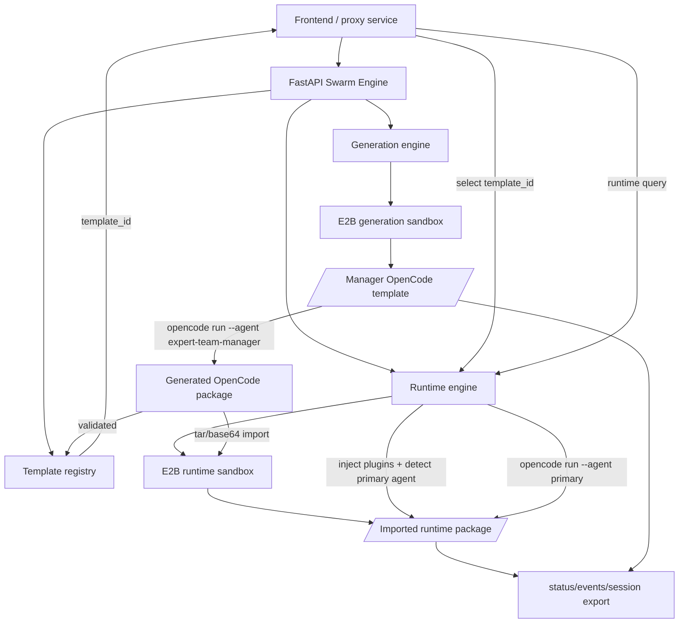

# Swarm Engine

Multi-session FastAPI engine for generating OpenCode agent team packages inside E2B `opencode` sandboxes.

## Runtime Contract

- One engine process serves many users.
- One `session_id` owns one active E2B sandbox.
- Generated files and session state are written inside the sandbox under `/home/user/template/.engine-sessions/<session_id>`.
- One `runtime_session_id` owns a separate E2B sandbox used to run a generated OpenCode package.
- Runtime packages are imported under `/home/user/template/.runtime-sessions/<runtime_session_id>/package`.
- S3 sync is intentionally external. The engine returns paths for the proxy service to read and upload.
- Secrets are read from environment variables only:
  - `E2B_API_KEY`
  - `DEEPSEEK_API_KEY`
  - `OPENCODE_MODEL`
  - `E2B_TIMEOUT_SECONDS`, default `1800`

## Run

```bash
uvicorn engine.app:app --host 0.0.0.0 --port 8000
```

## Real E2B Smoke

Export runtime keys first; do not put them in source files.

```bash
python scripts/e2b_smoke.py --keep-sandbox
python scripts/e2b_smoke.py --query "create a software delivery expert team" --output-slug software-delivery-team --keep-sandbox
```

## API

Create a session:

```bash
curl -X POST http://localhost:8000/v1/sessions \
  -H "content-type: application/json" \
  -d '{"user_id":"user-1"}'
```

Generate a package:

```bash
curl -X POST http://localhost:8000/v1/sessions/<session_id>/generate \
  -H "content-type: application/json" \
  -d '{"user_id":"user-1","query":"create a software delivery expert team","output_root":"exports","output_slug":"software-delivery-team"}'
```

`output_root` is optional. Relative paths are resolved under `/home/user/template`; absolute paths must also stay under `/home/user/template` so OpenCode does not reject writes as external-directory access.

List generated templates for a frontend picker:

```bash
curl "http://localhost:8000/v1/templates?user_id=user-1"
```

Create a runtime session from the generated package:

```bash
curl -X POST http://localhost:8000/v1/runtime-sessions \
  -H "content-type: application/json" \
  -d '{"user_id":"user-1","template_id":"<template_id>"}'
```

Run a query with the imported generated team:

```bash
curl -X POST http://localhost:8000/v1/runtime-sessions/<runtime_session_id>/query \
  -H "content-type: application/json" \
  -d '{"user_id":"user-1","query":"analyze this new request"}'
```

## Architecture

The service has two related execution paths.



Generation path:

1. `POST /v1/sessions` creates a sandbox and copies the manager template to `/home/user/template`.
2. The engine injects `session-export.ts`, `session-import.ts`, and generated `proxy-hooks.ts`.
3. `POST /v1/sessions/{session_id}/generate` runs `opencode run --agent expert-team-manager`.
4. The generated OpenCode package is validated and returned as `generated_package_path`.
5. The engine registers a template record and returns `data.template_id` for frontend selection.
6. Template metadata is also written to `.engine-sessions/<session_id>/state/template-<template_id>.json`.

Runtime path:

1. The frontend lists available templates with `GET /v1/templates?user_id=...`.
2. The user selects a `template_id`.
3. `POST /v1/runtime-sessions` creates a fresh sandbox from that template.
4. The engine archives the generated package from the source sandbox with `tar | base64`.
5. The new sandbox extracts it under `.runtime-sessions/<runtime_session_id>/package`.
6. The engine injects the same plugins into the imported package and merges the plugin entries into `opencode.json`.
7. The engine detects the generated package's primary agent from `opencode.json`.
8. `POST /v1/runtime-sessions/{runtime_session_id}/query` runs `opencode run --agent <primary-agent>` in the imported package directory.

## Interfaces

### Creation Sessions

- `POST /v1/sessions`
  - Request: `user_id`, optional `webhook_url`, optional `session_status_url`, optional `keep_sandbox`.
  - Response: `session_id`, `sandbox_id`, `status`, `session_export_path`, `state_path`.

- `POST /v1/sessions/{session_id}/generate`
  - Request: `user_id`, `query`, optional `sandbox_id`, optional `output_root`, optional `output_slug`, optional `timeout_ms`.
  - Response: `generated_package_path`, `status`, `data.template_id`, `data.validation_stdout`, errors if any.

- `GET /v1/sessions/{session_id}/status?user_id=<user_id>`
  - Response: current creation session state.

- `POST /v1/sessions/{session_id}/close`
  - Request: `user_id`, optional `sandbox_id`.
  - Response: closed creation session state.

### Runtime Sessions

- `GET /v1/templates?user_id=<user_id>`
  - Response: generated templates visible to the user. Each item includes `template_id`, `source_session_id`, `source_sandbox_id`, `package_path`, `output_root`, `output_slug`, and `status`.

- `GET /v1/templates/{template_id}?user_id=<user_id>`
  - Response: a single generated template record.

- `POST /v1/runtime-sessions`
  - Request: `user_id`, recommended `template_id`, optional `source_session_id`, optional `source_sandbox_id`, optional `generated_package_path`, optional `webhook_url`, optional `session_status_url`, optional `keep_sandbox`.
  - Response: `runtime_session_id`, `sandbox_id`, `source_session_id`, `source_sandbox_id`, `source_package_path`, `runtime_package_path`, `session_export_path`, `state_path`, `data.primary_agent`.

- `POST /v1/runtime-sessions/{runtime_session_id}/query`
  - Request: `user_id`, `query`, optional `sandbox_id`, optional `agent`, optional `timeout_ms`.
  - Response: runtime session state with `data.last_stdout`, `data.last_stderr`, `data.last_result_path`.

- `GET /v1/runtime-sessions/{runtime_session_id}/status?user_id=<user_id>`
  - Response: current runtime session state.

- `POST /v1/runtime-sessions/{runtime_session_id}/close`
  - Request: `user_id`, optional `sandbox_id`.
  - Response: closed runtime session state.
